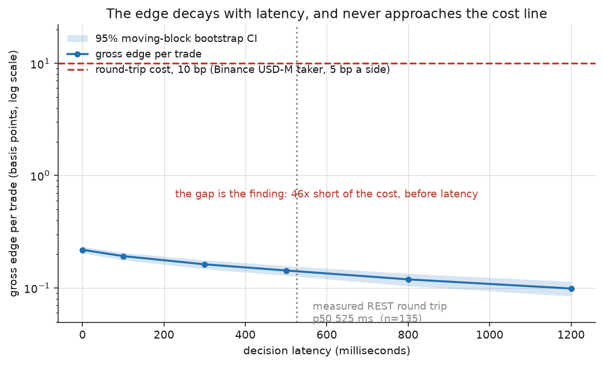
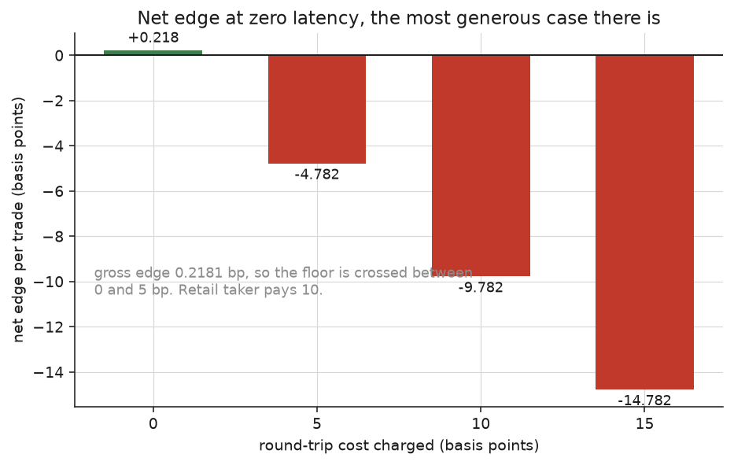
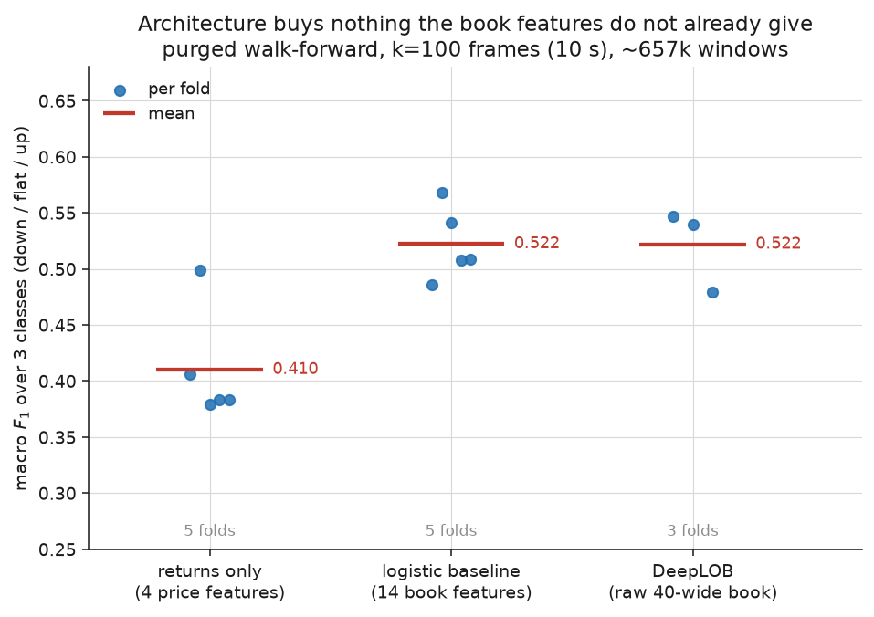
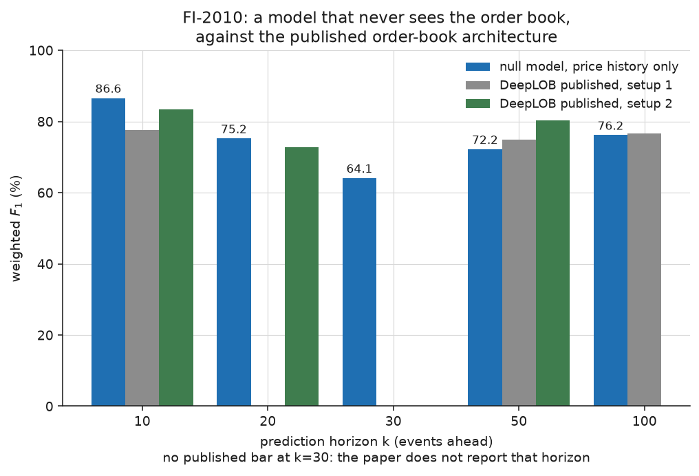
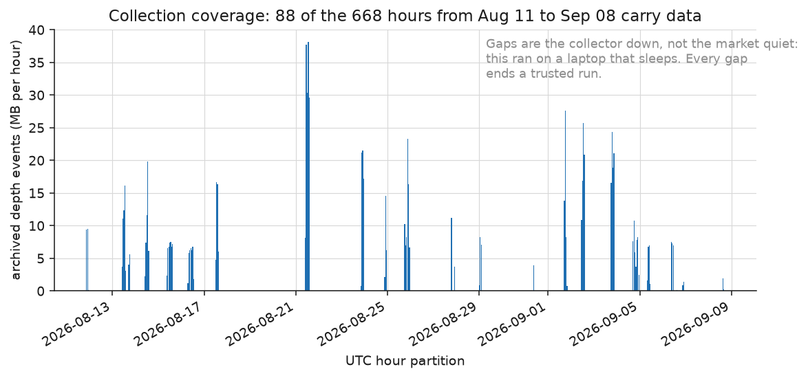
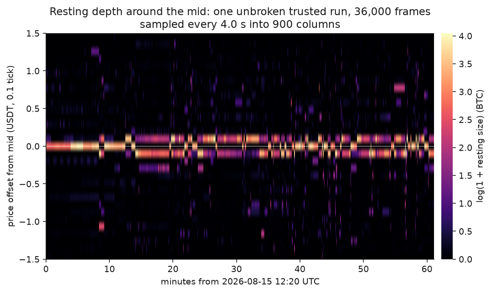

# LOBForge

**Question.** Does a deep model reading the limit order book predict short-horizon
price direction well enough to pay for the cost of trading on it?

**Finding.** No, and not by a small margin. On 1,395,304 reconstructed frames of
Binance USD-M BTCUSDT, the best model's gross edge is **0.2181 bp per trade**
(95% moving-block bootstrap CI 0.2040 – 0.2329). A retail round trip costs
**10 bp**. The signal is real — the interval excludes zero — and it is **46x too
small to trade**. Latency then removes another 35.4% of it at this machine's
measured 525 ms round trip, but that hardly matters: the edge was already two
orders of magnitude short before the first millisecond of delay.

Two supporting results point the same way. A deep architecture (DeepLOB) scores
the *same* macro F1 as a 14-feature logistic regression on our data, 0.522 both.
And on the FI-2010 benchmark, a model that never sees the order book at all —
seven features, all of them price history — beats the published DeepLOB numbers
at two of the four horizons the paper reports.

This is not a failed experiment. Costing the prediction is the experiment.



---

## Results

Every number below comes from a run artefact in `runs/`, from the dataset
build, or from a scan of the archive. None of the three are committed - they are
regenerable, and large - so every value is recorded in
[`docs/figures/figure-data.json`](docs/figures/figure-data.json) beside the file
it came from, under a `generated_utc` stamp. The collector is still running, so
anything scanned out of `data/` is true as of that stamp and not after it.

### Cost decomposition

The edge, and everything charged against it. One trade, in basis points.

| Component | Value | Note |
|---|---:|---|
| Gross edge, 0 ms latency | **+0.2181 bp** | 845,369 trades, 73.0% of windows |
| — 95% CI, moving-block bootstrap | [+0.2040, +0.2329] | block = 2 x label horizon |
| — 95% CI, sd/sqrt(n) | [+0.2146, +0.2215] | **4.2x too narrow**; do not quote it |
| Spread to cross, round trip | −0.0157 bp | median full spread; *not* charged above |
| Latency, at measured 525 ms p50 | −35.4% of edge | 0.2181 → 0.1408 bp, interpolated |
| Fees, Binance USD-M taker | −10.0 bp | 5 bp a side |
| **Net at 10 bp round trip** | **−9.78 bp** | |

The gross edge is measured mid to mid, so the spread is not yet deducted from it
— and it barely matters, because BTCUSDT is one tick wide almost always.
Latency costs a third of the edge. **Fees are the entire result**: 46x the gross
edge, at zero latency, which is the most generous case that exists.

The signal is real, and the finding does not rest on it being noise. The
moving-block bootstrap interval **excludes zero at every one of the six
latencies swept** — [+0.2040, +0.2329] at 0 ms, [+0.1770, +0.2060] at 100 ms,
[+0.1472, +0.1769] at 300 ms, [+0.1287, +0.1570] at 500 ms, [+0.1040, +0.1341]
at 800 ms, [+0.0844, +0.1137] at 1200 ms. There is something in the book at
every horizon tested. It is 46x too small to trade at the best of them. **That
is the answer to the question, not a failure to answer it**: a cost floor is a
result, and it is the result that decides whether any of the modelling above was
worth doing.



### Three models, same folds, same labels

Purged walk-forward, k = 100 frames (10 s horizon), ~657k windows. Macro F1 over
three classes (down / flat / up), threshold anchored to the training fold's
median half-spread.

| Model | Input | Folds | Macro F1 | Accuracy |
|---|---|---:|---:|---:|
| returns only | 4 price features | 5 | 0.410 | 0.685 |
| logistic baseline | 14 book features | 5 | **0.522** | 0.706 |
| DeepLOB | raw 40-wide book, CNN + inception + LSTM | 3 | **0.522** | 0.717 |

Fold spread is part of the result: baseline folds run 0.486 – 0.568, DeepLOB
0.479 – 0.547. The architecture's mean sits inside the baseline's fold-to-fold
noise. It buys nothing.



DeepLOB uses 3 folds and stride 20 because it was trained under a fixed CPU
budget; that gives it 8,186 – 24,598 training windows against the baseline's
109,279 – 546,798. The comparison is therefore *generous to the baseline on data
volume and generous to DeepLOB on nothing*. Both are plotted only on the dataset
build where both were actually run.

### FI-2010: the benchmark does not need the book

A null model — returns at 5 lags plus realised volatility at 2 windows, no
depth, no imbalance, no spread, no levels 2–10 — against the published DeepLOB
weighted F1. Setup 2 is the comparable split (train on the first 7 days, test on
the last 3); setup 1 is the paper's 9-fold anchored CV, shown because it is what
gets quoted.

| Horizon k | Null model | DeepLOB setup 1 | DeepLOB setup 2 |
|---:|---:|---:|---:|
| 10 | **86.6** | 77.66 | 83.40 |
| 20 | **75.2** | — | 72.82 |
| 30 | 64.1 | — | — |
| 50 | 72.2 | 74.96 | 80.35 |
| 100 | 76.2 | 76.58 | — |

The null model wins at k=10 and k=20 and loses at k=50 and k=100. A benchmark on
which price history alone matches a book-reading architecture is not measuring
what it is cited as measuring. Blank cells are horizons the paper does not
report — including k=30, where our own score dips in a way we cannot explain
(see Limitations).



### Does undetected desync manufacture predictability?

**It inflates it.** Splicing a book across a gap makes the result look better
than it is, and in the direction that matters most: it turns a measurably
negative edge into a measurably positive one.

`gapstudy.py` replays the same archive hours twice, dropping the same random
sample of depth events in both, and differs only in what happens when the
sequence breaks. The **trusted** arm desyncs, ends the run, and re-anchors on
the next snapshot. The **naive** arm never checks `pu`, so the break is
invisible and the stale levels the missing events would have moved stay in the
book. **naive@trusted** is the control that separates the two effects: the naive
book, scored on the *trusted* arm's window set, so the only thing still
differing between it and the trusted row is the book itself.

| drop rate | arm | windows | crossed frames | macro F1 | gross edge | 95% CI (bp) |
|---:|---|---:|---:|---:|---:|---|
| 0.000 | trusted | 49,623 | 0 | 0.2649 | +0.0225 | [−0.0155, +0.0703] |
| 0.000 | naive@trusted | 49,623 | 0 | 0.2649 | +0.0225 | [−0.0155, +0.0703] |
| 0.000 | naive | 49,623 | 0 | 0.2649 | +0.0225 | [−0.0155, +0.0703] |
| 0.005 | trusted | 19,781 | 0 | 0.1894 | −0.0781 | [−0.1461, −0.0311] |
| 0.005 | naive@trusted | 19,781 | 2,848 | **0.2431** | −0.0160 | [−0.0699, +0.0366] |
| 0.005 | naive | 49,392 | 2,848 | **0.2969** | +0.0742 | [+0.0396, +0.1205] |
| 0.020 | trusted | 1,432 | 0 | — | — | *cannot answer* |
| 0.020 | naive@trusted | 1,432 | 41,579 | — | — | *cannot answer* |
| 0.020 | naive | 48,627 | 41,579 | 0.1865 | +0.0120 | [−0.0061, +0.0304] |

The p = 0 block is the control on the control: drop nothing and all three arms
must be identical, and they are.

At p = 0.005, the only rate where all three arms return a number:

- **Corruption alone is worth +0.0537 macro F1** — 0.1894 → 0.2431 on the same
  19,781 windows. That is the phantom liquidity looking predictable, and it is
  the effect the study was built to measure.
- **A naive pipeline would report +0.1076** — 0.1894 → 0.2969. The extra +0.0538
  is not corruption at all. It is the naive arm keeping 49,392 windows where the
  trusted arm keeps 19,781, and more training data alone moves macro F1. **Half
  the apparent effect is sample size**, which is exactly why the middle row is
  reported separately instead of being folded into the corruption number.
- **The sign of the edge flips.** Trusted −0.0781 bp with a CI excluding zero on
  the negative side; naive +0.0742 bp with a CI excluding zero on the positive
  side. Same hours, same dropped packets, same folds. Only the trust index
  differs, and it is the difference between a strategy you would reject and one
  you would fund.

The crossed-frame column is the mechanism rather than a diagnostic: 2,848 frames
at p = 0.005 and 41,579 at p = 0.02 hold a bid above an ask — a book state that
cannot exist in a real market — and the naive arm trains on them, labels them,
and trades them.

At p = 0.02 the trusted arm keeps 1,432 of 48,627 windows, 2.9%, and refuses to
report; the naive arm still prints a macro F1 to four decimal places. That
asymmetry is what respecting a trust index costs, and it is the reason to pay
it.

**Scope.** Three archive hours, 49,822 frames, k = 100, 3 folds, 2 epochs, from
`runs/gapstudy-1788687018.json` and confirmed at both shared rates by
`runs/gapstudy-1788688449.json`. This is a confound check sized as one, not a
headline result. The gaps are synthetic single-packet drops; whether the same
sign holds for the archive's own multi-hour outages is **not** established here
— the full-archive run was started and did not finish. See Limitations.

---

## Method

**Collected.** Binance USD-M futures `btcusdt@depth@100ms` diff stream and
`btcusdt@aggTrade`, archived verbatim to hour-partitioned gzipped JSONL, plus
periodic REST order book snapshots (1000 levels) and an explicit record of every
sequence discontinuity. 875.0 MB of depth events spanning 2026-08-11 to
2026-09-08, read at the `generated_utc` stamp in the sidecar and still growing:
the collector is running as this is written, so that byte total is a reading,
not a property of the project. The fixed quantity is the dataset build below,
which is frozen at 1,395,304 frames. The collector does no reconstruction and no
normalisation: whatever question gets asked later, the raw stream can still
answer it.

**Coverage is not continuous.** 88 of the 668 hours spanned carry data, because
this ran on a laptop that sleeps. Session gaps are visible in the figure below
and they are load-bearing — every gap ends a trusted interval.



**Book reconstruction.** Offline replay. Each depth diff carries `pu` (previous
final update id) and `u`; the engine applies an event only if `pu` chains onto
the last applied `u`. When it does not, the engine **desyncs**: it discards its
book, ends the current trusted interval, and waits for the next snapshot to
re-anchor. Prices are keyed as integer ticks with round-half-up, so two adjacent
half-tick prices cannot silently collapse onto one level. The output of a build
is `frames.npy` plus `intervals.json` — a trust index of the contiguous runs
during which the book was known to be correct. A window that spans a gap contains
a book state that never existed, and is never valid.

The build every result here uses was made on 2026-09-02 from 63 hour partitions
(645 MB, 2026-08-11 to 2026-09-02) and holds 1,395,304 frames: 27 trusted
intervals, longest 222,565 frames (6.2 hours), 26 desyncs, 56,110 events skipped,
28,080 events unanchored — no snapshot could place them on a trusted book. The
archive has since grown past it; nothing has been rebuilt.



**Folds are purged.** Expanding-window walk-forward. A training window whose
label horizon reaches into the test block would be labelled with test data, so
every such window is dropped, plus a further margin of one label horizon
(k = 100 frames, 10 s). That margin is the default and cannot be turned off by
passing zero. An embargo guards the mirror case (training data drawn from after
a test block); a forward walk produces none, so it stands as a tripwire against
a future change to the split scheme, not as a no-op.

**Labels and normalisation are per fold.** The label threshold alpha is the
median half-spread of the *training* fold, and the z-score mean and standard
deviation are fitted on the training portion only. Computing either over the
whole dataset uses the future to describe the past, produces better numbers, and
never raises an error. `build_dataset.py` therefore emits neither labels nor
normalised features — it emits mid and spread so the evaluation tier can build
them itself, per fold. A dataset artifact that already contains labels has baked
in a leak that nothing downstream can detect.

**Multi-symbol collection is one container per symbol** (`scripts/multi-symbol.sh`),
never one collector serving several archives. A crash, an OOM kill or a wedged
writer in one symbol must not be able to touch another symbol's data.

---

## What was deliberately not built

The omissions are part of the argument. Each of these would have made the repo
look more like a trading system and would have taught nothing.

- **No Kafka, no message bus.** One producer, one consumer, one disk. A queue
  between them adds a second place for data to be lost and a second thing to
  operate. The failure this project actually has is *the laptop sleeps*, which
  no broker fixes.
- **No scheduler, no Airflow.** The pipeline is six scripts run in order. A DAG
  engine to express "run these four things" is a dependency with an operations
  cost and no user.
- **No live trading, no paper trading, no execution simulator.** The whole
  finding is that the edge is 46x below the cost floor. Building an execution
  layer to trade a signal already measured as untradeable would be building the
  answer to a question the measurement closed.
- **No dashboard.** `monitor.py` is a terminal view of the collector's health
  because that is what was needed at 3 a.m. A web dashboard would have been a
  second service to keep alive.
- **No fourth architecture.** Adding a transformer after DeepLOB matched a
  logistic regression would be answering "is the model big enough" when the
  evidence says the ceiling is the cost of trading, not the model.
- **No hyperparameter search worth the name.** `runs/trials.jsonl` is a ledger
  of every trial, written *before* the run rather than after, because a
  best-of-N score with an unreported N is not a result. It holds 53 starts and
  28 finishes at the sidecar stamp: 25 trials were abandoned, and they are still
  in the denominator.

---

## Reproduce it

```sh
git clone <this repo> lobforge && cd lobforge
python3 -m venv .venv && . .venv/bin/activate
pip install -e ".[dev,research]"           # or: pip install -r requirements.txt
pytest -q                                    # 80 passed
```

Collect. This is the part that takes days; nothing downstream works without it.

```sh
cp .env.example .env
docker compose build
docker compose up -d
docker compose logs -f          # wait for "subscription verified"
./scripts/multi-symbol.sh       # optional: ethusdt, solusdt, dogeusdt alongside
```

Reconstruct, then measure. Each script writes a JSON into `runs/`.

```sh
python3 build_dataset.py --data data --out dataset

python3 evaluate.py --model returns  --label forward --k 100 --folds 5
python3 evaluate.py --model baseline --label forward --k 100 --folds 5
python3 evaluate.py --model deeplob  --label forward --k 100 --folds 3 \
                    --stride 20 --epochs 8

python3 costfloor.py --k 100 --folds 5
python3 fi2010.py --download --epochs 80 --patience 10 --seed 1
python3 gapstudy.py --hours 3 --rates 0,0.005,0.02 \
                    --folds 3 --epochs 2 --min-ends 3000

python3 scripts/make_figures.py            # -> docs/figures/
```

A different symbol is a different archive and a different dataset. The tick size
is checked against the observed price granularity and the build fails loudly on
a mismatch, because a wrong tick merges price levels silently:

```sh
python3 build_dataset.py --data data-ethusdt --out dataset-ethusdt
```

---

## Limitations

Read these before citing anything above.

- **One symbol.** Every result is BTCUSDT. Collection for ETHUSDT, SOLUSDT and
  DOGEUSDT started on 2026-09-06 and has not yet produced enough data to
  reconstruct anything; no result here reflects them. A cost floor measured on
  the tightest, deepest book in crypto is the *best* case, and it still fails.
- **One directional regime.** The dataset spans 2026-08-11 to 2026-09-02, over
  which BTC went 63,590.75 → 76,783.05, **+20.7%**. Nothing here says how the
  models behave in a downtrend or a flat market. The per-fold majority-class
  accuracy runs 0.36, 0.50, 0.78, 0.92, 0.89 across the walk-forward: that is the
  trend showing up directly in the labels, and it is why accuracy is not the
  headline metric.
- **Coverage is 13.2%.** 88 of 668 hours. The archive is a set of sessions, not
  a continuous record, and the sessions are biased toward whenever the laptop
  was awake.
- **DeepLOB is under-trained and visibly overfitting.** Fixed CPU budget: 3
  folds, stride 20, 8 epochs, 8,186 training windows in fold 0. Its per-fold F1
  falls monotonically (0.547 → 0.540 → 0.479) as the test blocks move into the
  trend. A properly resourced DeepLOB might well beat the baseline on F1. To
  change the finding it would have to produce roughly 46x more edge, which is a
  different quantity and a far larger gap.
- **FI-2010 is not run to the published protocol.** 137,337 of 139,587 test rows
  are evaluated — a **1.6% trim** — dropping feature warm-up rows and the last
  k rows of each instrument, whose published labels are computed across a stock
  boundary and are meaningless. The trim removes contamination rather than
  adding any, but it is a deviation and the comparison is not exact.
- **The k=30 FI-2010 result is unexplained.** Weighted F1 dips to 64.1 at k=30
  while k=20 gives 75.2 and k=50 gives 72.2. Non-monotonic in the horizon, stable
  across seeds, and k=30 is a horizon the paper does not report so there is
  nothing to check it against. We do not know why.
- **Early stopping selects on the test fold. Every BTCUSDT number here is an
  upper bound.** This is the sharpest limitation in the repository and it was
  found while writing this README, after the runs it invalidates. Three scripts
  build the per-epoch validation set as a stride-10 slice of the *test* block —
  `evaluate.py:272`, `costfloor.py:130` and `gapstudy.py:239` — so the epoch that
  gets reported is the epoch that scored best on the data it is then scored on.

  Stated precisely, because the precision is the point: **the direction of the
  bias is known and its magnitude is not.** Early stopping cannot select an
  epoch that is worse on the selection set, so the reported number is at or
  above the honest one; nothing in these runs measures how far above. Every
  macro F1 and every gross edge in `runs/` — the cost floor, the three-model
  table, the gap study — is therefore a ceiling, not an estimate.

  What survives it: the bias applies **uniformly**, the same slice rule and the
  same patience across all three models and across all three arms of the gap
  study, so comparisons between them hold where absolute levels do not. What
  does not survive it: any reading of an absolute macro F1 as the score a
  correctly-stopped model would get.

  It does not rescue the finding, and the arithmetic for that is not close — the
  bias would have to be worth roughly 46x the measured edge to lift it over the
  cost floor, and it is bounded by the gap between a stride-10 slice and the full
  block it was drawn from.

  **FI-2010 is exempt**, and this was verified rather than assumed: `fi2010.py`
  builds its validation set with `split_fit_val`, a tail taken out of each
  *training* segment at `--val-frac 0.1`, with normalisation fitted on the fit
  rows only. Nothing on the FI-2010 table above is touched by this.

  Not fixed, because the fix is a held-out tail of each training fold and it
  invalidates every run in `runs/`, which is days of CPU to regenerate. It is the
  first thing the next session should do. See `docs/CHANGELOG-2026-09-06.md`.
- **The gap study is three hours of synthetic drops.** The inflation result
  above is measured on 49,822 frames with single depth events dropped at random,
  not on the archive's own outages, which are hours long because the laptop
  slept. A multi-hour splice and a one-packet splice are not obviously the same
  phenomenon and this repo has not measured the first. A full-archive run was
  started on 2026-09-07 and did not finish; it produced no `runs/*.json` and
  nothing from it is quoted here or in the changelog.

- **The purge margin is 100 frames, not the feature memory.** Windows are
  excluded when their label horizon comes within one horizon (10 s) of the test
  block. Two features have longer memory than that — `ret_30s_bp` and
  `rv_30s_bp` reach back 30 s — so a training window right at the boundary can
  still see across it. A purge wider than the longest feature would be correct
  and was not swept.
- **Single seed for the headline numbers.** On FI-2010, seeds 0 and 1 differ by
  under 0.1 percentage points of weighted F1 at every horizon. The BTCUSDT
  numbers were never run at a second seed.

---

Built with AI assistance (Claude). The design decisions, the experiments and the
interpretation are the author's; a substantial fraction of the code was written
in collaboration with an LLM.

MIT licensed - see [LICENSE](LICENSE).
